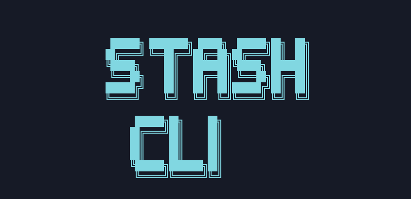
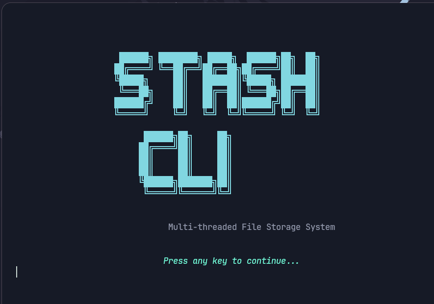
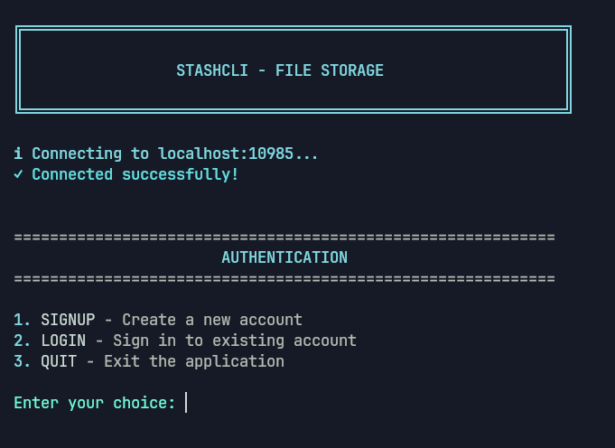
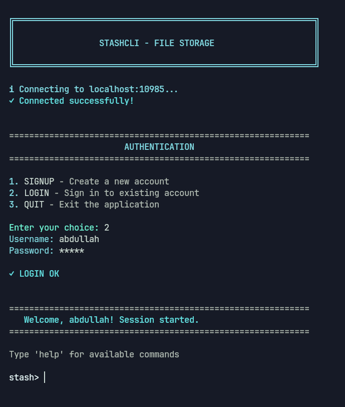
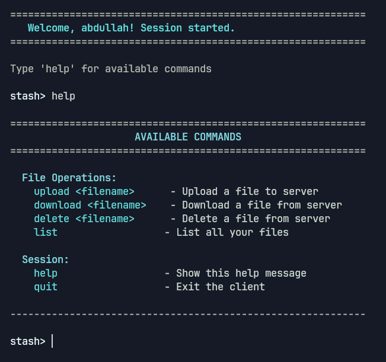
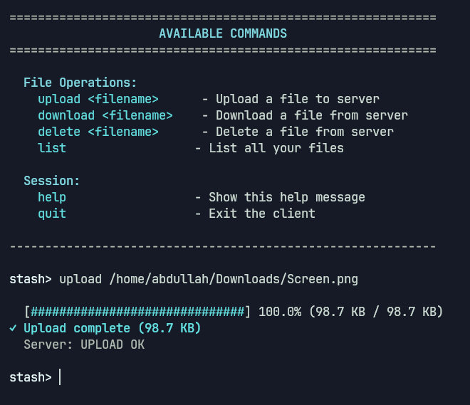
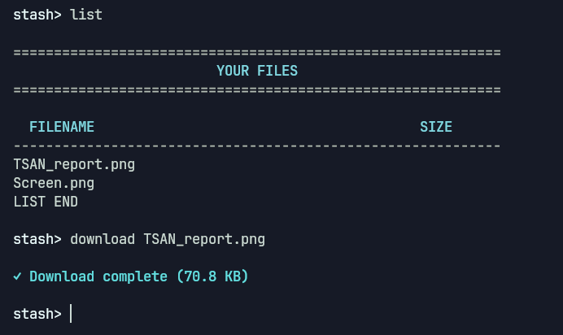
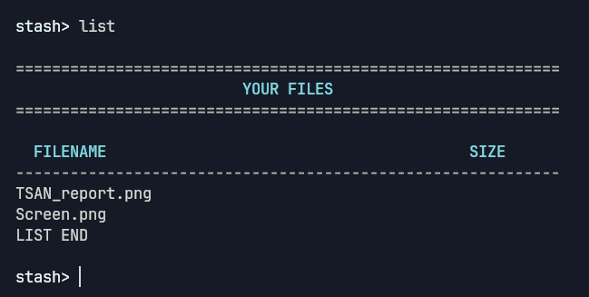
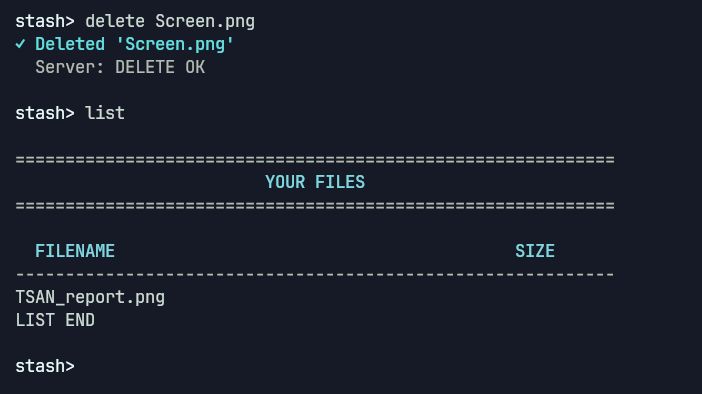
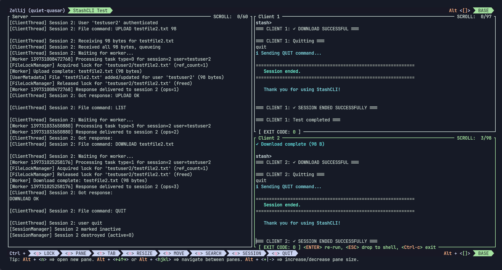

<p align="center">
  
</p>

<h1 align="center">StashCLI - Multi-threaded File Storage Server</h1>

<h2 align="center" style="color: #4fd8eb; font-style: italic; font-weight: normal;">
StashCLI: Stash your "stuff" on our servers using our world-famous plaintext protocol! Zero privacy, zero security, but hey—passwords are SHAshed (not bashed). Quotas are honored if you upload slow enough, and yes, we sell your data to pay for hosting our one server (spoiler: it's localhost). Real hackers know where to look. Use at your own risk.
</h2>

<p align="center">
  A multi-threaded file storage server implementing user authentication, per-user quotas, and concurrent file operations using a three-layer thread architecture.
</p>

For detailed documentation and reports, see the `docs/` directory.

---

## Features

- **User Authentication:** SIGNUP and LOGIN with SHA256 password hashing
- **File Operations:** UPLOAD, DOWNLOAD, DELETE, LIST
- **Per-User Quota:** 100MB storage limit per user
- **Concurrency:** Handles multiple concurrent clients with per-file locking
- **Thread-Safe:** Zero data races (ThreadSanitizer verified)
- **Memory-Safe:** Zero memory leaks (Valgrind verified)

---

## User Interface

<p align="center">
  
</p>

StashCLI features a modern terminal user interface (TUI) with color-coded output, progress bars, and an intuitive command structure.

### Authentication

Upon connecting to the server, users are presented with an authentication menu to create a new account or sign in:



After selecting an option, users can enter their credentials securely (passwords are masked with asterisks):



### Available Commands

Once authenticated, users can access various file operations. The `help` command displays all available commands:



### File Upload

Upload files with real-time progress tracking showing transfer speed and completion percentage:



### File Download

Download files from the server with visual progress indicators:



### File Listing

View all stored files with their sizes, total storage usage, and quota consumption displayed in an organized table format with a visual quota progress bar:



### File Deletion

Delete files with clear success/failure feedback:



### Multi-Session Support

StashCLI supports concurrent connections, allowing multiple users to interact with the server simultaneously. Here's an example using Zellij terminal multiplexer:



---

## Build Instructions

### Prerequisites

```bash
sudo apt update
sudo apt install build-essential libsqlite3-dev libssl-dev
```

### Build

```bash
# Build server and client
make

# Build server only
make server

# Build client only
make stashcli

# Build TSAN-enabled server (for testing)
make server-tsan

# Clean build artifacts
make clean
```

---

## Run Instructions

### Start Server

```bash
# Default port 10985
./server

# Custom port
./server 8080
```

### Start Client

```bash
# Connect to localhost:10985
./stashcli

# Connect to custom host/port
./stashcli <host> <port>
```

---

## Testing

### Automated Test Suites

```bash
# Phase 1 acceptance tests (11 tests)
./tests/test_phase1.sh

# Phase 2 concurrency tests (8 scenarios)
./tests/test_phase2_concurrency.sh

# Complete demo (functional tests)
./tests/demo_phase2.sh

# ThreadSanitizer verification
./tests/demo_tsan.sh

# Valgrind memory leak check
./tests/demo_valgrind.sh
```

### Manual Testing

**ThreadSanitizer:**
```bash
make server-tsan
./server-tsan
# Run tests in another terminal, check stderr for warnings
```

**Valgrind:**
```bash
valgrind --leak-check=full --show-leak-kinds=all ./server
# Run tests, then Ctrl+C to shutdown, check summary
```

---

## Architecture Overview

### Three-Layer Thread Design

1. **Main/Accept Thread**
   - Listens for TCP connections on port 10985
   - Pushes accepted sockets to ClientQueue

2. **Client Thread Pool** (4 threads)
   - Dequeues sockets from ClientQueue
   - Handles user authentication (SIGNUP/LOGIN)
   - Parses commands and validates quota
   - Queues tasks to TaskQueue
   - Waits for worker responses via condition variables (no busy-waiting)
   - Sends responses to client sockets

3. **Worker Thread Pool** (4 threads)
   - Dequeues tasks from TaskQueue
   - Acquires per-file locks
   - Performs file I/O operations
   - Updates metadata in SQLite database
   - Delivers results to client threads via session-based CV signaling

### Concurrency Control

- **Queue Synchronization:** Mutex + condition variables for ClientQueue and TaskQueue
- **Session Management:** Hash table (256 max) with per-session response objects
- **File Locking:** Per-file mutex manager (1024 max) with reference counting
- **Database:** SQLite with FULLMUTEX mode and transaction-based atomic updates
- **Worker→Client Delivery:** Session-based response with CV signaling (no busy-waiting)

---

## Protocol

Text-based protocol with binary data transfer:

**Authentication:**
```
SIGNUP <username> <password>
LOGIN <username> <password>
```

**File Operations:**
```
UPLOAD <filename> <size>
<binary data (size bytes)>

DOWNLOAD <filename>

DELETE <filename>

LIST
```

**Responses:**
- Status messages (text)
- Binary file data for DOWNLOAD

See `docs/PROTOCOL.md` for detailed specification.

---

## Project Structure

```
StashCLI/
├── Makefile                   # Build configuration
├── README.md                  # This file
├── client/
│   └── client.c               # Test client program
├── src/
│   ├── main.c                 # Entry point, accept loop
│   ├── server.h               # Global declarations
│   ├── threads/
│   │   ├── client_thread.c    # Client thread handler
│   │   └── worker_thread.c    # Worker thread handler
│   ├── queue/
│   │   ├── client_queue.c     # Socket queue
│   │   └── task_queue.c       # Task queue
│   ├── session/
│   │   ├── session_manager.c  # Session tracking
│   │   └── response_queue.c   # Worker→client responses
│   ├── auth/
│   │   ├── auth.c             # Authentication logic
│   │   ├── user_metadata.c    # User metadata API
│   │   └── database.c         # SQLite database layer
│   ├── sync/
│   │   └── file_locks.c       # Per-file lock manager
│   └── utils/
│       └── network_utils.c    # Socket I/O helpers
├── storage/
│   ├── stash.db               # SQLite database
│   └── <username>/            # User file directories
├── tests/
│   ├── test_phase1.sh         # Phase 1 acceptance tests
│   ├── test_phase2_concurrency.sh  # Phase 2 concurrency tests
│   ├── demo_phase2.sh         # Functional demo
│   ├── demo_tsan.sh           # TSAN demo
│   └── demo_valgrind.sh       # Valgrind demo
└── docs/
    ├── phase1_report.md       # Phase 1 design report
    ├── phase2_report.md       # Phase 2 design report
    ├── PROTOCOL.md            # Protocol specification
    └── TESTING_RESULTS.md     # Detailed test results
```

---

## Test Results

### ThreadSanitizer (TSAN)
- **Status:** ✅ PASS
- **Data Races Detected:** 0
- **Tests Performed:** 19 scenarios (Phase 1 + Phase 2)

### Valgrind
- **Status:** ✅ PASS
- **Memory Leaks:** 0 bytes
- **Allocations:** 4,420
- **Frees:** 4,420 (perfect balance)

### Functional Tests
- **Phase 1:** 11/11 tests passing
- **Phase 2:** 8/8 concurrency scenarios passing

See `docs/TESTING_RESULTS.md` for complete verification details.

---

## Known Limitations

- **Max Concurrent Sessions:** 256 (configurable via `MAX_SESSIONS` in `src/session/session_manager.h`)
- **Max File Locks:** 1024 (configurable via `MAX_FILE_LOCKS` in `src/sync/file_locks.h`)
- **Password Hashing:** SHA256 (acceptable for educational project; bcrypt recommended for production)
- **No Encryption:** Plaintext protocol (TLS/SSL not implemented)
- **Quota Enforcement:** Soft limit (checked before upload, but concurrent operations may briefly exceed)

---

## Design Reports

- **Phase 1 Report:** `docs/phase1_report.md` - Thread architecture, queues, synchronization
- **Phase 2 Report:** `docs/phase2_report.md` - Concurrency control, multi-session support, verification