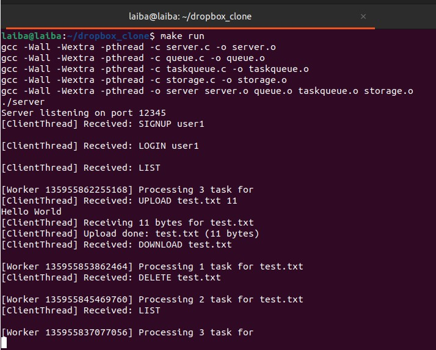
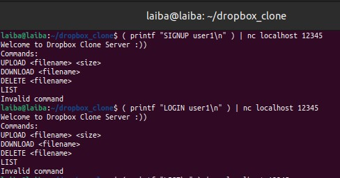
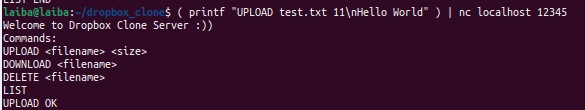
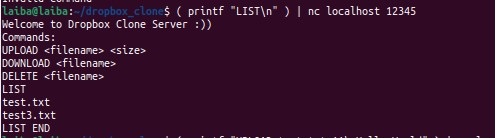
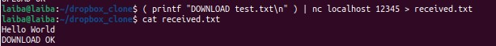
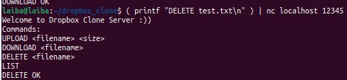

# Dropbox Clone

Multi-threaded client-server file storage system with upload, download, delete and list features

## 📘 Project Overview

This project implements a **Dropbox-like file storage server** using C, sockets and multithreading.  
It allows clients to connect to the server and perform operations such as:

- **SIGNUP / LOGIN** — Create or log into a user account
- **UPLOAD** — Send a file to the server
- **DOWNLOAD** — Retrieve a file from the server
- **DELETE** — Remove a file from the server
- **LIST** — View all uploaded files for a user

The design follows a producer-consumer model using synchronized queues for efficient concurrent execution.

---

## ⚙️ How to Build and Run

### 🧩 Step 1 — Prerequisites

Make sure your Ubuntu system has these installed:

```bash
sudo apt update
sudo apt install build-essential netcat
```

### 🧩 Step 2 — Build the Project

Navigate to your project folder:
```bash
cd ~/dropbox_clone
```

Build the server using the provided Makefile:
```bash
make
```

If successful, you'll see:
```bash
gcc -Wall -Wextra -pthread -o server server.c queue.c taskqueue.c storage.c
```

### 🧩 Step 3 — Run the Server

Start the server:
```bash
make run
```

Expected output:
```
Server listening on port 12345
```

Keep this terminal open — it will display logs of client connections and file operations.



### 🧩 Step 4 — Run the Client (Testing)

Open a second terminal for client commands using `nc` (netcat).
Use the test commands below to interact with your server.

---

## 🧪 Tests and Demonstrations

### 🧩 Test 1 — SIGNUP and LOGIN

**Command:**

```bash
( printf "SIGNUP user1\n" ) | nc localhost 12345
( printf "LOGIN user1\n" ) | nc localhost 12345
```

**Expected Output:**

```
SIGNUP OK
LOGIN OK
```



---

### 🧩 Test 2 — UPLOAD

**Command:**

```bash
( printf "UPLOAD test.txt 11\nHello World" ) | nc localhost 12345
```

**Server Output Example:**

```
[ClientThread] Received: UPLOAD test.txt 11
Hello World
[ClientThread] Receiving 11 bytes for test.txt
```

**Verify file:**

```bash
cat storage/user1/test.txt
```



---

### 🧩 Test 3 — LIST

**Command:**

```bash
( printf "LIST\n" ) | nc localhost 12345
```



---

### 🧩 Test 4 — DOWNLOAD

**Command:**

```bash
( printf "DOWNLOAD test.txt\n" ) | nc localhost 12345 > received.txt
cat received.txt
```

**Expected Output:**

```
Hello World
DOWNLOAD OK
```



---

### 🧩 Test 5 — DELETE

**Command:**

```bash
( printf "DELETE test.txt\n" ) | nc localhost 12345
```

**Expected Output:**

```
DELETE OK
```

**Then verify the file is deleted:**

```bash
( printf "LIST\n" ) | nc localhost 12345
```

**Expected Output:**

```
LIST OK
```



---

## 📝 Notes

- All user files are stored in `storage/<username>/` directories
- The server uses multithreading to handle multiple concurrent client connections
- File operations are queued and processed using a producer-consumer pattern

---

## 🛠️ Technologies Used

- **Language:** C
- **Networking:** BSD Sockets
- **Concurrency:** POSIX Threads (pthread)
- **Build System:** Make

---

## 📄 License

This project is open source and available for educational purposes.