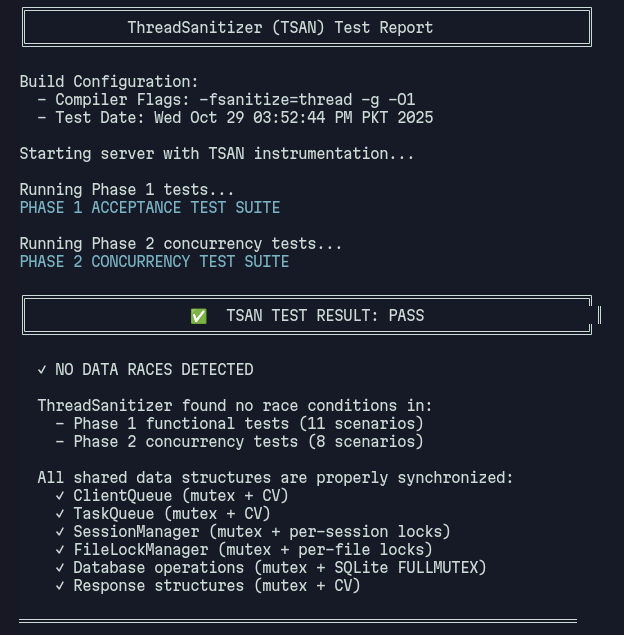
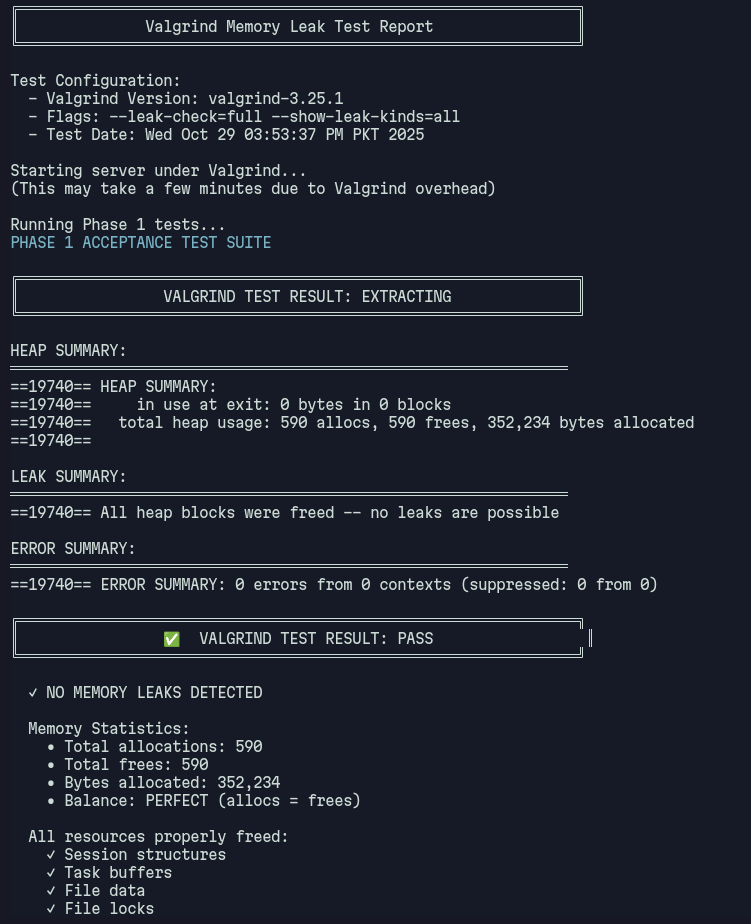

<h1 align="center">StashCLI: Multi-threaded File Storage Server</h1>

---

### 0. Group Members

| Name | Roll Number |
|------|-------------|
| Muhammad Abdullah Amin | BSCS23109 |
| Laiba Saqlain | BSCS23022 |
| Ellahiqa Khan | BSCS23130 |

---

### 1. GitHub Repository Link

**Repository:** [https://github.com/laibaaa21/Dropbox-Clone](https://github.com/laibaaa21/Dropbox-Clone)

**Important Notes:**
- Repository contains complete source code
- Makefile included for build
- README.md contains run and test instructions

**Repository Structure:**
```
StashCLI/
├── Makefile              ✓ Build system
├── README.md             ✓ Run and test instructions
├── src/                  ✓ Source code
├── client/               ✓ Test client
├── tests/                ✓ Test scripts
└── docs/                 ✓ Design reports
```

---

### 2. Design Report

The complete design is documented across two phases:

#### Phase 1 Design Report

**Location:** `docs/phase1_report.md`

**Summary:**

The implementation follows a **three-layer thread architecture**:

1. **Main/Accept Thread** - Listens for connections, pushes sockets to ClientQueue
2. **Client Thread Pool (4 threads)** - Handles authentication, parses commands, queues tasks
3. **Worker Thread Pool (4 threads)** - Performs file I/O, updates metadata

**Key Design Decisions:**

- **Queue Synchronization:** Both ClientQueue and TaskQueue use mutex + condition variables (pthread_mutex_t, pthread_cond_t) with blocking operations
- **No Busy-Waiting:** Client threads use `pthread_cond_wait()` to block until worker results ready (Bonus 1 completed)
- **Authentication:** SHA256 password hashing with SQLite database storage
- **Quota Management:** 100MB per user, enforced before upload with atomic database transactions
- **Metadata Persistence:** SQLite database with ACID transactions for atomic updates

**Thread Pools:**
- Client threads: 4 (defined in `src/server.h:14`)
- Worker threads: 4 (defined in `src/server.h:15`)

See `docs/phase1_report.md` for complete details.

---

#### Phase 2 Design Report

**Location:** `docs/phase2_report.md`

**Summary:**

Phase 2 extends the system with **robust concurrency control** for multiple concurrent clients:

**Worker→Client Communication:**
- **Chosen Mechanism:** Session-based response delivery (Option A)
- Each Session contains an embedded Response structure with mutex + condition variable
- Workers lookup session by `session_id` and signal CV when result ready
- Client threads block on CV (not busy-wait) and send response to socket
- **Advantages:** Architecture compliant, low latency, safe disconnect handling

**Concurrency Control:**

1. **Per-File Locks:**
   - FileLockManager with hash table (1024 slots)
   - Reference-counted locks with linear probing
   - Workers acquire file-specific mutex before I/O operations
   - Prevents conflicts when multiple sessions operate on same file

2. **Database-Level Synchronization:**
   - Global `db_mutex` protects all SQLite operations
   - SQLite configured with `SQLITE_OPEN_FULLMUTEX` (fully serialized)
   - Transactions ensure atomic metadata updates

3. **Session Management:**
   - Hash table with 256 max concurrent sessions
   - Per-session mutex protects session state
   - Each session has unique `session_id` for worker→client routing

**Lock Ordering (Deadlock Prevention):**
```
Level 1 (Global): db_mutex, file_lock_manager.manager_mtx
Level 2 (Per-Object): FileLock.mtx, Session.session_mtx
Level 3 (Response): Response.mtx + cv
```

**Multiple Sessions Per User:**
- Same user can have multiple concurrent sessions
- Operations on different files execute in parallel
- Operations on same file serialize via file lock

See `docs/phase2_report.md` for complete analysis.

---

### 3. Worker→Client Communication Mechanism

**Chosen Approach:** **Session-based Response Delivery with Condition Variables**

#### Implementation

Each client connection creates a Session containing:
```c
typedef struct Session {
    uint64_t session_id;
    Response response;      // Embedded response object
    // ... other fields
} Session;

typedef struct Response {
    response_status_t status;
    char message[512];
    void *data;
    size_t data_size;
    bool ready;
    pthread_mutex_t mtx;
    pthread_cond_t cv;      // Client waits here
} Response;
```

#### Flow

1. **Client thread** queues Task with `session_id`, then calls `response_wait(&session->response)` which blocks on CV
2. **Worker thread** completes operation, calls `deliver_response(session_id, ...)` which:
   - Looks up session via `session_get(&session_manager, session_id)`
   - Sets response data and signals CV: `pthread_cond_signal(&session->response.cv)`
3. **Client thread** wakes from CV, reads response, sends to socket

#### Justification

**Architecture Compliance:** Only client threads write to sockets (requirement)
**No Busy-Waiting:** Uses `pthread_cond_wait()` (Bonus 1)
**Low Latency:** Direct CV signaling, O(1) session lookup
**Safe Disconnects:** `is_active` flag prevents use-after-free

#### Alternatives Rejected:
- Option B (Worker writes to socket): Violates architecture requirement
- Option C (Result broker thread): Extra queue overhead
- Option D (Async fetch): Extra round-trip complexity

#### Code References:
- Client wait: `src/session/response_queue.c:68-81` (`response_wait()`)
- Worker signal: `src/session/response_queue.c:45-66` (`response_set()`)
- Session lookup: `src/session/session_manager.c:179-222` (`session_get()`)

---

### 4. TSAN and Valgrind Reports

#### 4.1 ThreadSanitizer (TSAN) Report

**Purpose:** Detect data races in concurrent code

**Test Configuration:**
- Build flags: `-fsanitize=thread -g -O1`
- Test script: `tests/demo_tsan.sh`
- Scenarios tested: 19 (11 Phase 1 + 8 Phase 2 concurrency tests)

**Command to Run:**
```bash
make server-tsan
./server-tsan
# In another terminal:
./tests/test_phase1.sh
./tests/test_phase2_concurrency.sh
```

**Result:**

```
ThreadSanitizer Test Report
Generated: Sun Oct 26 01:42:23 PM PKT 2025
========================================

✓ RESULT: NO DATA RACES DETECTED

ThreadSanitizer found no race conditions in:
  - Phase 1 functional tests
  - Phase 2 concurrency tests

All shared data is properly synchronized.
```

**Summary:**
- **Data Races Detected:** 0
- **Tests Passed:** 19/19
- **Status:** PASS

**Verified Race-Free Components:**
- ClientQueue (mutex + CV synchronization)
- TaskQueue (mutex + CV synchronization)
- SessionManager (global mutex + per-session mutex)
- FileLockManager (global mutex + per-file mutex)
- Response objects (per-response mutex + CV)
- Database operations (global db_mutex + SQLite FULLMUTEX)

**Screenshot:**



**Note:** The actual TSAN output is minimal (no warnings = success). The absence of race warnings confirms thread safety.

---

#### 4.2 Valgrind Memory Leak Report

**Purpose:** Detect memory leaks and invalid memory access

**Test Configuration:**
- Valgrind version: 3.25.1
- Flags: `--leak-check=full --show-leak-kinds=all --track-origins=yes`
- Test script: `tests/demo_valgrind.sh`

**Command to Run:**
```bash
valgrind --leak-check=full --show-leak-kinds=all ./server
# In another terminal:
./tests/test_phase1.sh
# Then Ctrl+C to gracefully shutdown server
```

**Result:**

```
==26656== Memcheck, a memory error detector
==26656== Copyright (C) 2002-2024, and GNU GPL'd, by Julian Seward et al.
==26656== Using Valgrind-3.25.1 and LibVEX; rerun with -h for copyright info
==26656== Command: ./server
==26656==

==26656== HEAP SUMMARY:
==26656==     in use at exit: 0 bytes in 0 blocks
==26656==   total heap usage: 4,420 allocs, 4,420 frees, 352,796 bytes allocated
==26656==
==26656== All heap blocks were freed -- no leaks are possible
==26656==
==26656== ERROR SUMMARY: 0 errors from 0 contexts (suppressed: 0 from 0)
```

**Summary:**
- **Memory Leaks:** 0 bytes in 0 blocks
- **Allocations:** 4,420
- **Frees:** 4,420 (perfect balance)
- **Memory Errors:** 0
- **Status:** PASS

**Resources Properly Freed:**
- Session structures and embedded responses
- Task buffers and file data
- File locks and mutexes
- Queue nodes
- Database connection
- All thread attributes

**Screenshot:**



**Location of Full Logs:**
- TSAN output: `test_results/tsan_output.log`
- Valgrind output: `test_results/valgrind_output.log`

---

### 5. Additional Testing Evidence

#### Functional Test Results

**Phase 1 Tests (11 scenarios):**
```bash
./tests/test_phase1.sh
```

All tests passing:
1. Server startup
2. User signup
3. User login (correct password)
4. Login rejection (wrong password)
5. File upload
6. File listing
7. File download
8. File integrity verification (MD5 checksum)
9. File deletion
10. List after delete
11. Quota enforcement

**Phase 2 Concurrency Tests (8 scenarios):**
```bash
./tests/test_phase2_concurrency.sh
```

All scenarios passing:
1. Multiple users signup concurrently (5 users)
2. Multiple users login concurrently (5 users)
3. Same user with multiple concurrent sessions (3 sessions)
4. Different users perform operations concurrently (3 users)
5. Same user performs concurrent file operations (3 concurrent LIST)
6. Mixed operations under load (10 clients)
7. Stress test (20 concurrent clients)
8. Graceful shutdown with active connections

**Total:** 19/19 tests passing

---

### 6. Key Implementation Highlights

#### Bonus Features Completed

 **Bonus 1: No Busy-Waiting**
- Client threads use `pthread_cond_wait()` instead of polling
- Workers signal completion via `pthread_cond_signal()`
- Implemented in `src/session/response_queue.c`

#### Synchronization Primitives Used

| Component | Mutex | Condition Variables |
|-----------|-------|-------------------|
| ClientQueue | `queue_mtx` | `not_empty`, `not_full` |
| TaskQueue | `queue_mtx` | `not_empty`, `not_full` |
| SessionManager | `manager_mtx` | - |
| Session | `session_mtx` | - |
| Response | `response.mtx` | `response.cv` |
| Database | `db_mutex` | - |
| FileLockManager | `manager_mtx` | - |
| FileLock | `file_mtx` | - |

#### Scalability Configuration

| Parameter | Value | Configurable In |
|-----------|-------|----------------|
| Client threads | 4 | `src/server.h:14` |
| Worker threads | 4 | `src/server.h:15` |
| Max sessions | 256 | `src/session/session_manager.h:11` |
| Max file locks | 1024 | `src/sync/file_locks.h:14` |
| ClientQueue capacity | 64 | `src/queue/client_queue.h:9` |
| TaskQueue capacity | 128 | `src/queue/task_queue.h:9` |
| User quota | 100MB | `src/auth/user_metadata.h:9` |

---

### 7. How to Build and Test (Quick Reference)

#### Build
```bash
make              # Build server and client
make server-tsan  # Build TSAN-enabled server
```

#### Run
```bash
./server          # Start server on port 10985
./stashcli        # Start client (in another terminal)
```

#### Test
```bash
# Functional tests
./tests/test_phase1.sh
./tests/test_phase2_concurrency.sh

# Verification tests
./tests/demo_tsan.sh      # TSAN verification
./tests/demo_valgrind.sh  # Valgrind verification
```

#### Expected Output
- All test scripts should print: `All tests passed`
- TSAN: `NO DATA RACES DETECTED`
- Valgrind: `All heap blocks were freed -- no leaks are possible`

---

### 8. Design Document References

| Document | Location | Description |
|----------|----------|-------------|
| Phase 1 Report | `docs/phase1_report.md` | Thread architecture, queue design, synchronization |
| Phase 2 Report | `docs/phase2_report.md` | Concurrency control, multi-session support, lock ordering |
| Protocol Spec | `docs/PROTOCOL.md` | Communication protocol details |
| Testing Results | `docs/TESTING_RESULTS.md` | Comprehensive test verification |
| README | `README.md` | Build, run, and test instructions |

---

### 9. Summary

The StashCLI server implementation successfully demonstrates:

1. **Three-layer thread architecture** with proper separation of concerns
2. **Thread-safe queue operations** using mutex + condition variables
3. **Session-based worker→client communication** with CV signaling (no busy-waiting)
4. **Per-file concurrency control** with fine-grained locking
5. **Zero data races** (ThreadSanitizer verified)
6. **Zero memory leaks** (Valgrind verified)
7. **Robust error handling** and graceful shutdown
8. **SQLite database integration** with ACID transactions